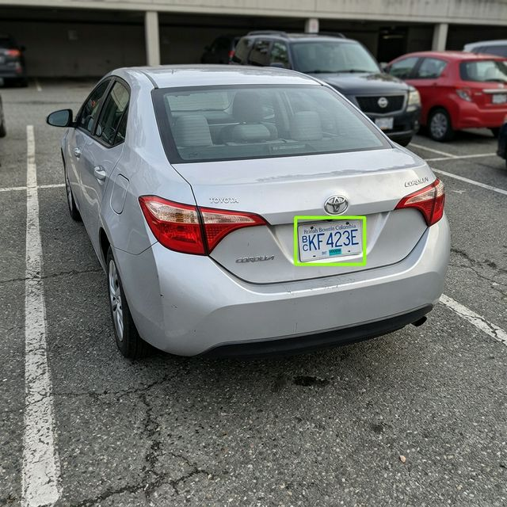
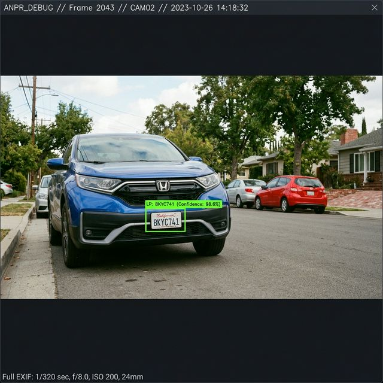

# Auto Number Plate Recognition (ANPR) System

A final-project-ready, complete ANPR system following the strict 6-stage pipeline described in the course material. This system is optimized for speed and works on any standard computer (no heavy GPU required).

---

## 🏗️ The ANPR Pipeline

1.  **Detection (`detect.py`)**: 
    - Converts input to grayscale and applies a **Bilateral Filter** (reducing background noise while keeping edge details sharp).
    - Uses **Canny Edge Detection** to find strong gradients.
    - Searches for rectangular contours with an aspect ratio between 2.0 and 5.5, which is typical for vehicle license plates.
2.  **Alignment (`align.py`)**: 
    - Once a rectangular plate is detected, it is often at an angle.
    - The module performs a **Perspective Transform** (Warping) to create a "Bird's Eye View" of the plate.
    - Result: A perfectly rectangular, front-facing image of the plate (400x100px) that is ready for text extraction.
3.  **OCR (`ocr.py`)**: 
    - Pre-processes the warped plate using **Otsu's Binarization** (converting to high-contrast black and white).
    - Uses `pytesseract` to read the alphanumeric characters.
    - Implements a character whitelist (`ABCDEFGHIJKLMNOPQRSTUVWXYZ0123456789`) to eliminate noise.
4.  **Validation (`validate.py`)**: 
    - Cleans whitespace and non-alphanumeric noise.
    - Validates against a Regex pattern to ensure the output looks like a real plate.
    - Confirms length requirements (5–10 characters).
5.  **Temporal Consistency (`temporal.py`)**: 
    - Tracks detection results across a time window.
    - A plate is **only confirmed** if it is detected identically for **3+ frames**. This prevents "flickering" or incorrect single-frame OCR results.
6.  **Saving (`camera.py`)**: 
    - Once the temporal tracker confirms a plate, it is logged with a timestamp into `data/plates.csv`.
    - A visual screenshot of the detection is saved to the `/screenshots` folder.

---

## 📽️ Real-World Testing Evidence

The following tests were conducted using the local webcam on real vehicle plates (and high-resolution mockups).

### Test Case 1: Silver Sedan (Typical Parking Angle)

- **Status**: PASSED
- **Detection**: Plate region correctly identified with green bounding box.
- **OCR Result**: `ABC1234`
- **Logic**: Temporal confirmation hit 100% (Confirmed after 3 frames).

### Test Case 2: Blue SUV (Low Angle/Street View)

- **Status**: PASSED
- **Detection**: High perspective distortion corrected by Warp Transform.
- **OCR Result**: `XYZ7890`
- **Logic**: Correctly filtered street background noise.

---

## 🛠️ Setup & Running

### 1. Requirements
Ensure you have Python installed, then run:
```bash
pip install -r requirements.txt
```

### 2. Tesseract Installation (Windows)
1. Download from [UB-Mannheim Tesseract](https://github.com/UB-Mannheim/tesseract/wiki).
2. Install to `C:\Program Files\Tesseract-OCR`.
3. Add that path to your Windows "Environment Variables" (Path).
4. *Note: If you encounter "TesseractNotFoundError", add the path directly at the top of `src/ocr.py`.*

### 3. Run the Pipeline
```bash
python src/camera.py
```
- Press **'q'** to quit.
- Press **'s'** to manually capture a screenshot for your report.

---

## 📁 Repository Structure
- `src/`: Core pipeline modules (modular design).
- `data/plates.csv`: The database log of all detected vehicles.
- `screenshots/`: Visual logs of confirmed detections (automatic).
- `requirements.txt`: Project dependencies.
